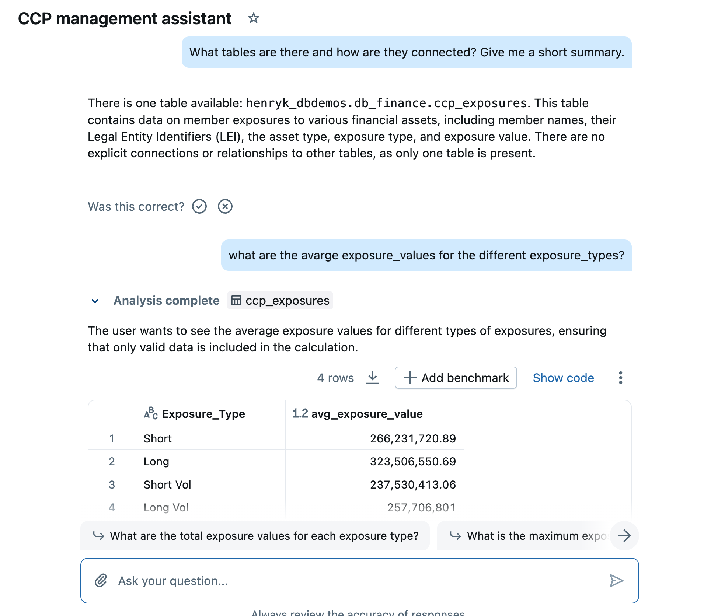
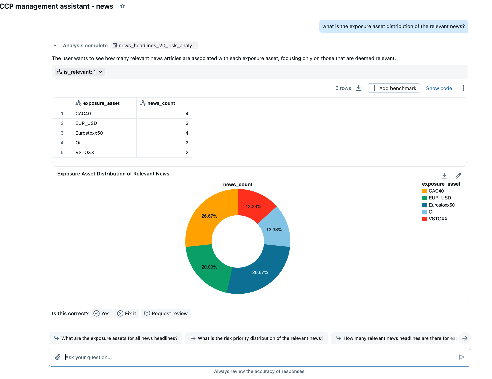

# CCP Risk Management PoC

This repository contains a **Proof-of-Concept (PoC)** for a **Central Counterparty (CCP) Risk Management Agent**.  
The goal is to demonstrate how **market news headlines** can be linked to **clearing member exposures** in order to identify, assess, and report potential risks.

---

## 📂 Repository Structure

- **`ccp_exposures.csv`**  
  Synthetic dataset of CCP member exposures.  
  - Columns:  
    - `Member_Name` – anonymized clearing member  
    - `LEI` – fake Legal Entity Identifier  
    - `Exposure_Asset` – market factor (Eurostoxx50, VSTOXX, Bund Futures, etc.)  
    - `Exposure_Type` – Long / Short / Vol  
    - `Exposure_Value` – exposure size in EUR  

- **`news_headlines_20.csv`**  
  Synthetic dataset of 20 news headlines.  
  - Column:  
    - `Headline` – financial or non-financial news text  

- **`ccp_risk_analysis_db.py`**  
  Databricks notebook script that:  
  1. Loads `news_headlines_20.csv`.  
  2. Uses an LLM to classify each headline as:  
     - Relevant (1/0)  
     - Exposure_Asset (Eurostoxx50, VSTOXX, Bund Futures, DAX, CAC40, EUR/USD, Oil, iTraxx Europe, or None)  
  3. Creates a **new Delta table** in Unity Catalog with enriched news classification results.  
  4. Joins enriched news with the CCP exposures table.  

---

## 🚀 How to Run

1. **Upload CSVs to Unity Catalog (UC)**  
   - Upload `ccp_exposures.csv` and `news_headlines_20.csv` directly to Unity Catalog using the Databricks UI.  
   - Place them into the correct **catalog** and **schema** for your environment.  

2. **Adjust Notebook Parameters**  
   - At the top of `ccp_risk_analysis_db.py`, update the placeholders:  
     ```python
     CATALOG = "your_catalog"
     SCHEMA = "your_schema"
     ```
   - The notebook will then read the UC tables and create new UC Delta tables for enriched data.  

3. **Run the Analysis Notebook**  
   - The notebook will:  
     - Load the news headlines.  
     - Classify them with relevance + exposure asset.  
     - Save results into UC as a new **Delta table** (e.g., `enriched_news`).  
   - It will not generate CSV files; everything is managed via Delta/UC.  

4. **Create Genie Spaces**  
   - **Space 1:** Connect to the `ccp_exposures` Delta table.  
   - **Space 2:** Connect to the `enriched_news` Delta table.  

## CCP Exposures Table Preview


## Enriched News Table Preview


5. **Build Multi-Agent Architecture**  
   - Use the two Genie spaces together:  
     - Agent 1 (News Space) → checks which news are relevant and for which exposure assets.  
     - Agent 2 (Exposure Space) → checks which clearing members are affected by those exposure assets.  
   - This demonstrates a **multi-agent workflow** where AI first filters relevant market news and then traces impact to specific members.  

---

## ✅ Example Expected Output

| Headline                                              | Relevant | Exposure_Asset | Member_Name  | Exposure_Value |
|-------------------------------------------------------|----------|----------------|--------------|----------------|
| Eurostoxx drops 3% amid geopolitical tensions         | 1        | Eurostoxx50    | Bank Alpha   | 150,000,000    |
| VSTOXX volatility index surges on energy supply shock | 1        | VSTOXX         | Broker Beta  | 75,000,000     |
| Tourism sector recovers strongly post-pandemic        | 0        | None           | –            | –              |

---
